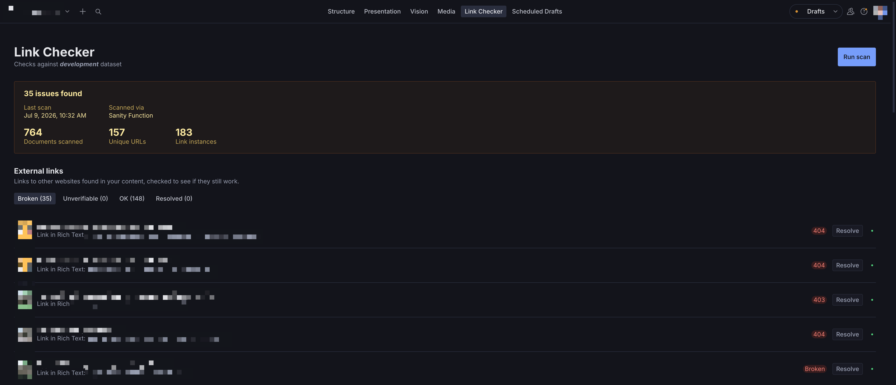

<p align="center">
  <picture>
    <source media="(prefers-color-scheme: dark)" srcset="assets/logo-dark.png">
    
  </picture>
  <br />
  <sub>Built by <a href="https://www.kodamera.se">Kodamera</a></sub>
</p>

# sanity-plugin-link-checker

<!-- TODO(plan-009): CI + npm version badges -->

Finds broken links and dangling references across a Sanity dataset and shows them in a
Studio tool, with one click to jump straight to the offending document. Works out of the
box for internal reference checks; deploy the included Document Function once for fully
accurate external-link results too.



## Features

- **Finds broken external links** — every URL in your content, checked over HTTP with real status codes (via the included Document Function or CLI).
- **Finds dangling references** — reference fields pointing at documents that no longer exist, checked against both published and draft versions.
- **Scans everything** — published documents, drafts, and release versions across the entire dataset.
- **Jump straight to the problem** — click any finding to open the document with the offending field focused and scrolled into view.
- **One shared report** — results are stored in the dataset itself, so every teammate and environment sees the same scan, live, with no manual steps.
- **Mark as resolved** — acknowledge findings you've handled; the marks survive re-scans.
- **CI-ready CLI** — fail a build when broken links are found, export the report as JSON.
- **Zero schema pollution** — the report document is not a registered schema type and never shows up in your content lists.
- **Extensible** — plug in your own URL checker (e.g. a proxy), or use the React-free scanning core in your own scripts and Functions.

## Installation

```sh
npm install sanity-plugin-link-checker
```

## Quick start

1. Add the plugin to `sanity.config.ts` (or `.js`):

   ```ts
   import {defineConfig} from 'sanity'
   import {linkChecker} from 'sanity-plugin-link-checker'

   export default defineConfig({
     //...
     plugins: [linkChecker()],
   })
   ```

2. Open the new **Link Checker** tool in the Studio menu and click **Run scan**.
3. (Recommended) Deploy the Document Function for accurate external-link results — one command, see the next section.

Results are stored in the dataset as a single, always-overwritten document, so every
environment (local Studio, deployed Studio, teammates) sees the same scan with no manual
step. Until step 3 is done, external checks run from the browser and are CORS-limited, so
most links come back `unverifiable` — see [Why browser checks are limited (CORS)](#why-browser-checks-are-limited-cors).

## Accurate external checks: deploy the Document Function (once)

Clicking "Run scan" writes a small trigger document (`linkCheckerTrigger`) alongside the
report. Deploying a [Sanity Document Function](https://www.sanity.io/docs/functions/functions-introduction)
that reacts to it makes the button fully server-side.

1. ```sh
   npx sanity-plugin-link-checker init-function
   ```
2. Add the printed resource to `sanity.blueprint.ts` (the command prints the exact snippet; if you don't have a blueprint file yet, it prints the `npx sanity blueprints init` step too).
3. ```sh
   npx sanity blueprints deploy
   ```

Once deployed, every "Run scan" click reruns the scan server-side (no CORS, real status
codes) and the results replace the browser-run ones live, within a few seconds — no
reload, no CLI to remember. Functions run on Sanity's included free tier for typical
link-checking volumes (20K GB-seconds + 500K invocations/month, included on all plans).

## CLI (CI pipelines and no-Function setups)

If you can't or don't want to deploy the Function, the same accurate Node-side scan is
available as a one-shot CLI — run it manually, on a cron, or as a CI step. It writes the
same report document the Studio tool reads, so results still show up in the tool.

```sh
npx sanity-plugin-link-checker \
  --project-id yourProjectId \
  --dataset production \
  --token $SANITY_AUTH_TOKEN
```

`--token` needs **write** access (e.g. an Editor-role API token), since it upserts the
report document. `--project-id` and `--dataset` also read from `SANITY_STUDIO_PROJECT_ID` /
`SANITY_STUDIO_DATASET` env vars if you already have those set, as most Studio projects do.

Use `--fail-on-findings` to make a CI job exit non-zero when broken links/references are
found, and `--out <path>` for a local JSON copy in CI logs:

```sh
npx sanity-plugin-link-checker --token $SANITY_AUTH_TOKEN --fail-on-findings --out report.json
```

Run `npx sanity-plugin-link-checker --help` for all options (`--concurrency`, `--timeout`, `--api-version`).

## Configuration

```ts
linkChecker({
  concurrency: 4, // max concurrent external URL checks
  timeoutMs: 8000, // per-request timeout
  apiVersion: '2024-01-01', // Sanity client API version
  checkUrl: async (url) => ({status: 'ok'}), // optional override, see Advanced below
  structureToolName: 'structure', // structure tool name, if renamed
})
```

| Option              | Type       | Default          | Description                                                                                             |
| ------------------- | ---------- | ---------------- | ------------------------------------------------------------------------------------------------------- |
| `concurrency`       | `number`   | `4`              | Max concurrent external URL checks                                                                      |
| `timeoutMs`         | `number`   | `8000`           | Per-request timeout                                                                                     |
| `apiVersion`        | `string`   | `'2024-01-01'`   | Sanity client API version                                                                               |
| `checkUrl`          | `function` | built-in checker | Override how a URL is checked (see [Custom URL checking via a proxy](#custom-url-checking-via-a-proxy)) |
| `structureToolName` | `string`   | `'structure'`    | Structure tool name used for "open document" links; only needed if renamed via `structureTool({name})`  |

## Advanced

### Custom URL checking via a proxy

If you'd rather click "Run scan" in Studio and get accurate external-link results
immediately (no separate CLI step), you can point the plugin at a server-side proxy
instead — same idea as the CLI (move the fetch off the browser), but as a live endpoint
instead of a one-shot script:

```ts
linkChecker({
  checkUrl: async (url) => {
    const res = await fetch(
      `https://your-proxy.example.com/api/check-link?url=${encodeURIComponent(url)}`,
      {headers: {'x-proxy-secret': process.env.SANITY_STUDIO_LINK_PROXY_SECRET ?? ''}},
    )
    return res.json() // {status: 'ok' | 'broken' | 'unverifiable', httpStatus?, reason?}
  },
})
```

A ready-to-deploy example proxy (Vercel-shaped Node function, with SSRF guardrails —
blocks loopback/private/link-local hosts and supports an optional shared secret) lives in
[`examples/link-check-proxy`](./examples/link-check-proxy). This requires you to host
something, unlike the CLI.

### Using the scanning logic in your own code

The Function, the CLI, and the Studio plugin all share the same scanning code, exported
React-free from `sanity-plugin-link-checker/core` (`runScan`, `writeReport`, `readReport`,
`writeTrigger`) for use in your own scripts or Functions.

### Why browser checks are limited (CORS)

Worth understanding _why_ the Function matters. External link checking is a `fetch`
against each URL. A browser can only read the real HTTP status of a **cross-origin**
request if the target server sends CORS headers back — most ordinary websites don't,
since they have no reason to let arbitrary pages read their responses. Without those
headers the request either throws a network error or resolves as unreadable, whether the
URL is a healthy page or a real 404.

So external checks run straight from the Studio browser tab land on `unverifiable` (or
`timeout`) rather than a clean `ok`/`broken`. This isn't a bug — it's what the browser
allows. Node has no such restriction, which is exactly why the Function (and the CLI
above) get real status codes.

### How results are stored

- Results are stored in the dataset as a single, always-overwritten document (`_id: 'link-checker-report'`, `_type: 'linkCheckerReport'`).
- It's not registered as a schema type, so it won't show up in your content lists, and it's exactly one document regardless of how many times you scan.
- Every environment (local Studio, deployed Studio, teammates) reads that same document, so a scan run anywhere shows up everywhere with no manual step.
- It's also cached in the browser (per project + dataset) for a fast first paint.

## License

[MIT](LICENSE) © Kodamera

## Develop & test

This plugin uses [@sanity/plugin-kit](https://github.com/sanity-io/plugin-kit)
with default configuration for build & watch scripts.

See [Testing a plugin in Sanity Studio](https://github.com/sanity-io/plugin-kit#testing-a-plugin-in-sanity-studio)
on how to run this plugin with hotreload in the studio.

### Release New Version

Run ["CI & Release" workflow](https://github.com/kodamera/sanity-plugin-link-checker/actions/workflows/main.yml).
Make sure to select the main branch and check "Release new version".

Semantic release will only publish from configured release branches, so it is safe to run the workflow from any branch.
