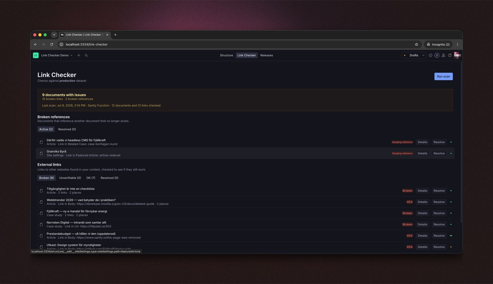
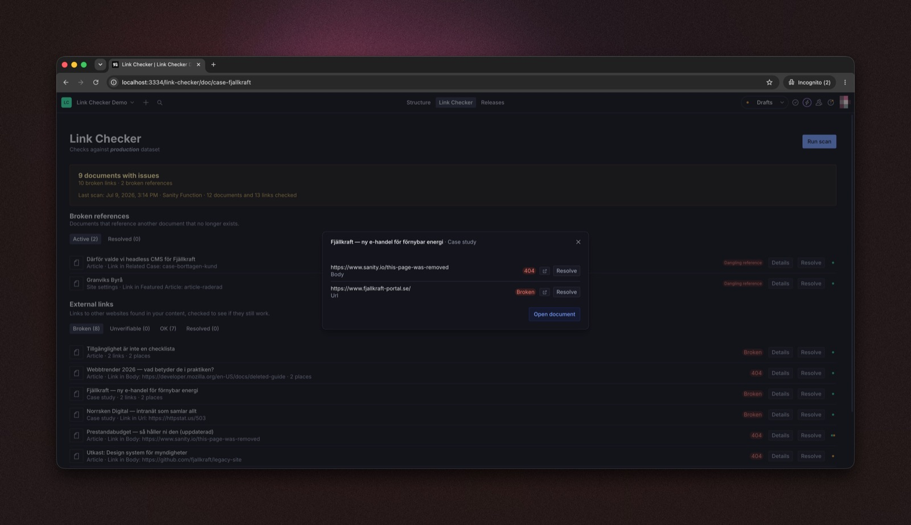
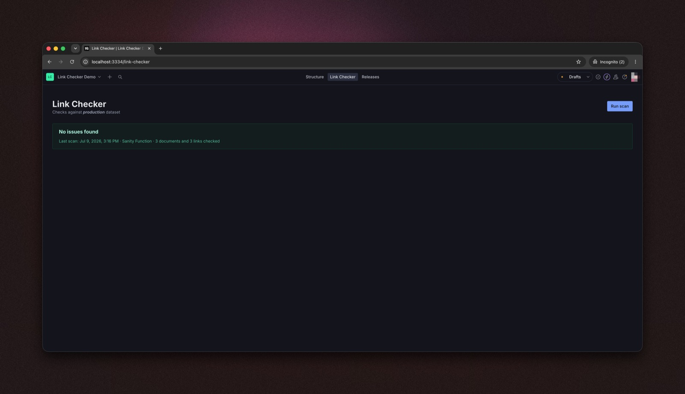
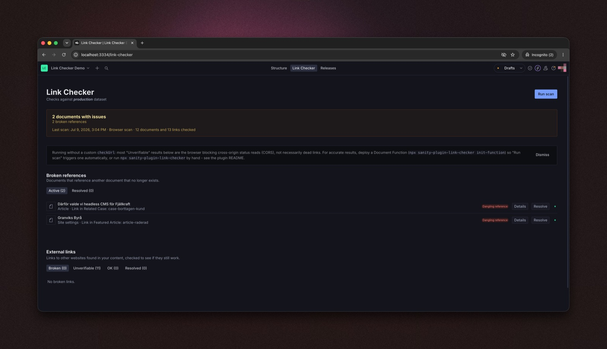

<picture>
  <source media="(prefers-color-scheme: dark)" srcset="assets/logo-dark.svg">
  
</picture>

<sub>Built by <a href="https://www.kodamera.se">Kodamera</a></sub>

# sanity-plugin-link-checker

[](https://www.npmjs.com/package/sanity-plugin-link-checker)
[](https://github.com/kodamera/sanity-plugin-link-checker/actions/workflows/main.yml)
[](LICENSE)

Finds broken links and dangling references across a Sanity dataset and shows them in a
Studio tool, with one click to jump straight to the offending document. Dangling-reference
checks work out of the box. **Accurate external-link checks need the included Document
Function** — one command to deploy — since browser-only checks are CORS-limited and mostly
come back `unverifiable` rather than a real answer.



## Table of contents

- [Features](#features)
- [Why check links in the CMS instead of crawling the site?](#why-check-links-in-the-cms-instead-of-crawling-the-site)
- [Installation](#installation)
- [Quick start](#quick-start)
- [Accurate external checks: deploy the Document Function (once)](#accurate-external-checks-deploy-the-document-function-once)
  - [Upgrading an already-deployed Function](#upgrading-an-already-deployed-function)
- [CLI (CI pipelines and no-Function setups)](#cli-ci-pipelines-and-no-function-setups)
- [Configuration](#configuration)
- [Advanced](#advanced)
  - [Custom URL checking via a proxy](#custom-url-checking-via-a-proxy)
  - [Using the scanning logic in your own code](#using-the-scanning-logic-in-your-own-code)
  - [Why browser checks are limited (CORS)](#why-browser-checks-are-limited-cors)
  - [Adding or overriding a language](#adding-or-overriding-a-language)
  - [How results are stored](#how-results-are-stored)
  - [Uninstalling](#uninstalling)
- [License](#license)
- [Develop & test](#develop--test)
  - [Release New Version](#release-new-version)

## Features

- **Finds broken external links** — every URL in your content, checked over HTTP with real status codes. Needs the included Document Function (or CLI) — the Studio's "Run scan" button alone is CORS-limited and can't give you real answers.
- **Finds dangling references** — reference fields pointing at documents that no longer exist, checked against both published and draft versions.
- **Scans everything** — published documents, drafts, and release versions across the entire dataset.
- **Jump straight to the problem** — click any finding to open the document with the offending field focused and scrolled into view.
- **One shared report** — results are stored in the dataset itself, so every teammate and environment sees the same scan, live, with no manual steps.
- **Mark as resolved** — acknowledge findings you've handled; the marks survive re-scans.
- **CI-ready CLI** — fail a build when broken links are found, export the report as JSON.
- **Zero schema pollution** — the report document is not a registered schema type and never shows up in your content lists.
- **Extensible** — plug in your own URL checker (e.g. a proxy), or use the React-free scanning core in your own scripts and Functions.

<table>
  <tr>
    <td width="50%">
      
      <br /><sub>Per-document details: every broken URL with its exact status code</sub>
    </td>
    <td width="50%">
      
      <br /><sub>A clean scan - nothing to fix</sub>
    </td>
  </tr>
</table>

## Why check links in the CMS instead of crawling the site?

Site crawlers and SEO suites (Ahrefs, Screaming Frog, Dr. Link Check, ...) find broken links by
crawling your **rendered pages**. That works — but it reports the symptom, not the source. This
plugin works on the content itself, which changes what's possible:

- **Catch problems before they're published.** Crawlers only see live pages. This scans drafts
  and release versions too, so a dead link in tomorrow's landing page never ships.
- **Fix in one click, not one investigation.** A crawler tells you _page X has a broken link_;
  someone still has to figure out which document and which field that came from. Here every
  finding opens the document with the offending field focused.
- **Dangling references are invisible to crawlers.** A reference to a deleted document usually
  doesn't render as a broken link — it renders as silently missing content. Only a
  content-side check can find it.
- **Editors work where they already are.** Findings live in the Studio with document previews,
  draft/published status, and a resolve workflow — no separate tool, login, or CSV export.
- **Free and unlimited.** No per-site subscription, no page quota; runs in your own
  infrastructure (browser, CLI, or a Sanity Function).

It's a complement, not a replacement: crawlers still cover what only rendered pages can show
(redirect chains, links added by frontend code, orphan pages) and off-site SEO (backlinks,
rankings). This covers the half they can't see — the content before it becomes a page.

## Installation

```sh
npm install sanity-plugin-link-checker
```

## Quick start

1. Add the plugin to `sanity.config.ts` (or `.js`):

   ```ts
   import {defineConfig} from 'sanity'
   import {linkChecker} from 'sanity-plugin-link-checker'

   export default defineConfig({
     //...
     plugins: [linkChecker()],
   })
   ```

2. Open the new **Link Checker** tool in the Studio menu and click **Run scan**.
3. Deploy the Document Function — one command, see the next section.

   > **Do this one.** Without the Function, external checks run from the browser and are
   > CORS-limited — most links come back `unverifiable` instead of a real broken/ok
   > answer. The Function is what makes external-link checking actually work.

Results are stored in the dataset as a single, always-overwritten document, so every
environment (local Studio, deployed Studio, teammates) sees the same scan with no manual
step. See [Why browser checks are limited (CORS)](#why-browser-checks-are-limited-cors) for
the full explanation.

## Accurate external checks: deploy the Document Function (once)

Clicking "Run scan" writes a small trigger document (`linkCheckerTrigger`) alongside the
report. Deploying a [Sanity Document Function](https://www.sanity.io/docs/functions/functions-introduction)
that reacts to it makes the button fully server-side.

1. ```sh
   npx sanity-plugin-link-checker init-function
   ```
2. Add the printed resource to `sanity.blueprint.ts` (the command prints the exact snippet; if you don't have a blueprint file yet, it prints the `npx sanity blueprints init` step too).
3. ```sh
   npx sanity blueprints deploy
   ```

Once deployed, every "Run scan" click reruns the scan server-side (no CORS, real status
codes) and the results replace the browser-run ones live, within a few seconds — no
reload, no CLI to remember. Functions run on Sanity's included free tier for typical
link-checking volumes (20K GB-seconds + 500K invocations/month, included on all plans).

### Upgrading an already-deployed Function

The scaffolded Function occasionally changes as the plugin evolves — most notably,
Functions scaffolded before the scan-scope config existed call
`runScan(client, {}, 'function')` and silently ignore every option you set in
`linkChecker({...})` (the browser pass filters correctly, then the Function
overwrites the report unfiltered). After upgrading the plugin, refresh your
Function:

```sh
npx sanity-plugin-link-checker init-function --force
npx sanity blueprints deploy
```

`--force` overwrites `functions/link-checker-scan/index.ts` with the current
template. If you customized the file, diff it first and port your changes.

## CLI (CI pipelines and no-Function setups)

If you can't or don't want to deploy the Function, the same accurate Node-side scan is
available as a one-shot CLI — run it manually, on a cron, or as a CI step. It writes the
same report document the Studio tool reads, so results still show up in the tool.

```sh
npx sanity-plugin-link-checker \
  --project-id yourProjectId \
  --dataset production \
  --token $SANITY_AUTH_TOKEN
```

`--token` needs **write** access (e.g. an Editor-role API token), since it upserts the
report document. `--project-id` and `--dataset` also read from `SANITY_STUDIO_PROJECT_ID` /
`SANITY_STUDIO_DATASET` env vars if you already have those set, as most Studio projects do.

Use `--fail-on-findings` to make a CI job exit non-zero when broken links/references are
found, and `--out <path>` for a local JSON copy in CI logs:

```sh
npx sanity-plugin-link-checker --token $SANITY_AUTH_TOKEN --fail-on-findings --out report.json
```

Run `npx sanity-plugin-link-checker --help` for all options (`--concurrency`, `--timeout`, `--host-delay`, `--exclude-types`, `--exclude-urls`, `--exclude-url-pattern`, `--ignore-drafts-older-than`, `--api-version`).

## Configuration

```ts
linkChecker({
  concurrency: 4, // max concurrent external URL checks
  timeoutMs: 8000, // per-request timeout
  hostDelayMs: 1000, // min gap between two requests to the same host
  excludeTypes: ['siteSettings'], // document types to skip entirely
  excludeUrls: ['linkedin.com'], // URLs to skip (substring or RegExp)
  ignoreDraftsOlderThanDays: 90, // skip abandoned never-published drafts
  skipInternalHostCheck: false, // flag links to localhost/private-network hosts
  internalHostPatterns: ['staging.example.com'], // extra hostnames to flag as internal
  detectBareDomains: false, // also flag domain-shaped values missing http(s)://
  apiVersion: '2024-01-01', // Sanity client API version
  checkUrl: async (url) => ({status: 'ok'}), // optional override, see Advanced below
  structureToolName: 'structure', // structure tool name, if renamed
})
```

| Option              | Type                   | Default          | Description                                                                                             |
| ------------------- | ---------------------- | ---------------- | ------------------------------------------------------------------------------------------------------- |
| `concurrency`       | `number`               | `4`              | Max concurrent external URL checks                                                                      |
| `timeoutMs`         | `number`               | `8000`           | Per-request timeout                                                                                     |
| `hostDelayMs`       | `number`               | `1000`           | Min ms between two requests to the same host - avoids tripping rate limiters                            |
| `excludeTypes`      | `string[]`             | `[]`             | Document types to skip entirely; `sanity.*` system types are always skipped                             |
| `excludeUrls`       | `(string \| RegExp)[]` | `[]`             | External URLs to skip - a string matches as a substring, a RegExp against the full URL. Useful for hosts that block automated checks (LinkedIn, ...) |
| `ignoreDraftsOlderThanDays` | `number`       | off              | Skip never-published drafts whose last edit is older than this many days. Drafts of published documents always scan, whatever their age |
| `skipInternalHostCheck` | `boolean`          | `false`          | Skip flagging links to localhost/private-network hosts. Only turn on if your project genuinely serves internal-only content that's expected to link to private addresses |
| `internalHostPatterns` | `(string \| RegExp)[]` | `[]`         | Extra hostnames to flag as internal, beyond the built-in loopback/private/link-local ranges - e.g. your own staging subdomain |
| `detectBareDomains` | `boolean`              | `false`          | Also flag string values that look like a domain but are missing `http://`/`https://` (e.g. a field whose whole value is `example.com`). Off by default - the domain-shape + real-TLD heuristic is tuned to avoid likely false positives (`Node.js`, `README.md`, `install.sh`, `script.py`, and ordinary filenames), but can't be made airtight; turn on deliberately and review what it finds |
| `apiVersion`        | `string`               | `'2024-01-01'`   | Sanity client API version                                                                               |
| `checkUrl`          | `function`             | built-in checker | Override how a URL is checked (see [Custom URL checking via a proxy](#custom-url-checking-via-a-proxy)) |
| `structureToolName` | `string`               | `'structure'`    | Structure tool name used for "open document" links; only needed if renamed via `structureTool({name})`  |

## Advanced

### Custom URL checking via a proxy

If you'd rather click "Run scan" in Studio and get accurate external-link results
immediately (no separate CLI step), you can point the plugin at a server-side proxy
instead — same idea as the CLI (move the fetch off the browser), but as a live endpoint
instead of a one-shot script:

```ts
linkChecker({
  checkUrl: async (url) => {
    const res = await fetch(
      `https://your-proxy.example.com/api/check-link?url=${encodeURIComponent(url)}`,
      {headers: {'x-proxy-secret': process.env.SANITY_STUDIO_LINK_PROXY_SECRET ?? ''}},
    )
    return res.json() // {status: 'ok' | 'broken' | 'unverifiable', httpStatus?, reason?}
  },
})
```

A ready-to-deploy example proxy (Vercel-shaped Node function, with SSRF guardrails —
blocks loopback/private/link-local hosts and supports an optional shared secret) lives in
[`examples/link-check-proxy`](./examples/link-check-proxy). This requires you to host
something, unlike the CLI.

### Using the scanning logic in your own code

The Function, the CLI, and the Studio plugin all share the same scanning code, exported
React-free from `sanity-plugin-link-checker/core` for use in your own scripts or
Functions: `runScan`, `writeReport`, `readReport`, `writeTrigger`, and `summarizeResult`
(the same broken/unverifiable counting logic the CLI's `--fail-on-findings` gate uses).
See [`src/core.ts`](src/core.ts) for the full list, including the acknowledgement and
trigger-config helpers.

### Why browser checks are limited (CORS)

Worth understanding _why_ the Function matters. External link checking is a `fetch`
against each URL. A browser can only read the real HTTP status of a **cross-origin**
request if the target server sends CORS headers back — most ordinary websites don't,
since they have no reason to let arbitrary pages read their responses. Without those
headers the request either throws a network error or resolves as unreadable, whether the
URL is a healthy page or a real 404.

So external checks run straight from the Studio browser tab land on `unverifiable` (or
`timeout`) rather than a clean `ok`/`broken`. This isn't a bug — it's what the browser
allows. Node has no such restriction, which is exactly why the Function (and the CLI
above) get real status codes.



### Adding or overriding a language

The plugin ships English (`en-US`) and Swedish (`sv-SE`). Rather than a config option
on `linkChecker()`, translations use Sanity's own `i18n.bundles` mechanism — register
another bundle for the same namespace in your `sanity.config.ts` and it merges over
(or adds to) the built-in strings automatically, no plugin-side setting needed:

```ts
import {defineConfig} from 'sanity'
import {defineLocaleResourceBundle} from 'sanity'
import {linkChecker, linkCheckerLocaleNamespace} from 'sanity-plugin-link-checker'

export default defineConfig({
  plugins: [linkChecker()],
  i18n: {
    bundles: [
      defineLocaleResourceBundle({
        locale: 'de-DE',
        namespace: linkCheckerLocaleNamespace,
        resources: {'result.resolve': 'Auflösen', 'result.details': 'Details'},
        // Bundles merge with overwrite: true by default, so a partial resource
        // object (like this one) fills in just the keys you provide — everything
        // else falls back to the plugin's built-in en-US strings.
      }),
    ],
  },
})
```

This also works to correct or restyle an existing `en-US`/`sv-SE` string, or add a
locale this plugin doesn't ship at all — as long as it's a locale your Studio itself
supports (see [Sanity's locale plugins](https://www.sanity.io/docs/studio/internationalization)
for the full list; translating this plugin into a language the Studio's own chrome
doesn't speak yields a half-translated UI). See
[`src/i18n/resources.ts`](src/i18n/resources.ts) for every translatable key (English), or
[`src/i18n/resources.sv.ts`](src/i18n/resources.sv.ts) for a full second-locale example.

### How results are stored

- Results are stored in the dataset as a single, always-overwritten document (`_id: 'link-checker-report'`, `_type: 'linkCheckerReport'`).
- It's not registered as a schema type, so it won't show up in your content lists, and it's exactly one document regardless of how many times you scan.
- Every environment (local Studio, deployed Studio, teammates) reads that same document, so a scan run anywhere shows up everywhere with no manual step.
- It's also cached in the browser (per project + dataset) for a fast first paint.

### Uninstalling

Removing `linkChecker()` from `sanity.config.ts` only stops the plugin's Studio UI and
API calls — it doesn't touch the dataset. Two documents are left behind, since neither
is a schema type the Studio's own deletion UI would surface:

- `link-checker-report` (`_type: 'linkCheckerReport'`) — the scan results
- `link-checker-trigger` (`_type: 'linkCheckerTrigger'`) — only present if you use the
  "Run scan" button with a deployed Document Function

Delete them with the Sanity CLI, from a Studio project directory:

```sh
npx sanity documents delete link-checker-report
npx sanity documents delete link-checker-trigger
```

Or via `@sanity/client`:

```ts
await client.delete('link-checker-report')
await client.delete('link-checker-trigger')
```

## License

[MIT](LICENSE) © Kodamera

## Develop & test

This plugin uses [@sanity/plugin-kit](https://github.com/sanity-io/plugins/tree/main/packages/%40sanity/plugin-kit)
with default configuration for build & watch scripts.

See [Testing a plugin in Sanity Studio](https://github.com/sanity-io/plugins/tree/main/packages/%40sanity/plugin-kit#testing-a-plugin-in-sanity-studio)
on how to run this plugin with hotreload in the studio.

### Release New Version

Run ["CI & Release" workflow](https://github.com/kodamera/sanity-plugin-link-checker/actions/workflows/main.yml).
Make sure to select the main branch and check "Release new version".

Semantic release will only publish from configured release branches, so it is safe to run the workflow from any branch.
